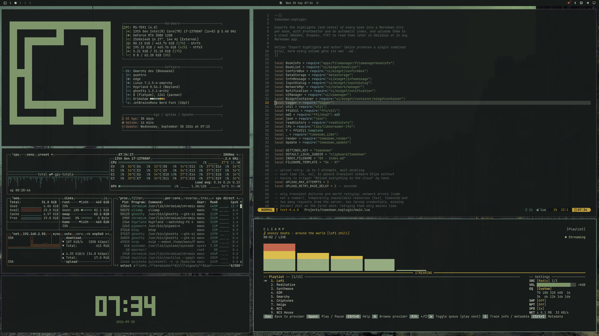

# Grimshaw

**Gaslight on wet cobbles.**
A dark Victorian nocturne theme for Omarchy, painted in the colors of
John Atkinson Grimshaw's moonlit docks and streets.

<p align="center">
  
</p>

---

## Installation

```bash
omarchy theme install https://github.com/imanubdesigner/omarchy-grimshaw-theme
```

Then pick **Grimshaw** from *Style > Theme* in the Omarchy menu.

## Palette

Soot-black backgrounds with a green cast, pale sage text, and a sage-teal
accent. Lamp-yellow and brick-red are kept for warnings and highlights, the way
a single lit window stands out in the paintings.

Everything is generated from one `colors.toml`.

| | Name | Hex |
| --- | --- | --- |
|  | Background | `#171b1a` |
|  | Foreground | `#b8c2ae` |
|  | Accent | `#7fa38d` |
|  | Yellow (lamplight) | `#c9a63a` |
|  | Orange | `#c98a3e` |
|  | Red (brick) | `#b0573f` |
|  | Green (moss) | `#7f966b` |
|  | Cyan (harbour) | `#5c9680` |
|  | Blue | `#6f8f96` |

Icons use **Yaru-sage**.

## Backgrounds

Seven Grimshaw nocturnes in 16:9:

- *Canny Glasgow*
- *November Moonlight*
- *Quai de Paris, Rouen*
- *Reflections on the Thames, Westminster*
- *Shipping on the Clyde*
- *Silver Moonlight*
- *Whitby at Night*

## Notes

If the icons keep the previous theme's colors after switching, close Nautilus
(`nautilus -q`) and reapply the theme. With
[Omarchroma](https://github.com/NobleDoodle/omarchroma), run
`hyprchroma --force`.

## Credits

Paintings by [John Atkinson Grimshaw](https://en.wikipedia.org/wiki/John_Atkinson_Grimshaw)
(1836-1893), in the public domain.

Wallpapers from [Wallhaven](https://wallhaven.cc) and
[Wikimedia Commons](https://commons.wikimedia.org).
Built for [Omarchy](https://omarchy.org).
